# Program 10

```python
import pickle

def read_records():
    with open("emp.dat", "rb") as f:
        try:
            while True:
                emp = pickle.load(f)
                empcode = emp[0]
                name = emp[1]
                place = emp[2]
                salary = emp[3]

                print(empcode, name,place, salary)
        except EOFError:
            pass

def write_records():
    with open("emp.dat","ab") as f:
        n = int(input("Enter number of employees to be entered: "))
        for i in range(n):
            empcode = int(input("Enter employee code: "))
            name = input("Enter employee name: ")
            place = input("Enter employee place: ")
            salary = int(input("Enter employee salary: "))

            emp = [empcode,name,place,salary]
            pickle.dump(emp,f)

while True:
    ch = input("Enter choice:\n1. Read record\n2. Write record: ")
    if ch == "1":
        read_records()
    elif ch == "2":
        write_records()
    else:
        print("Invalid choice")


```

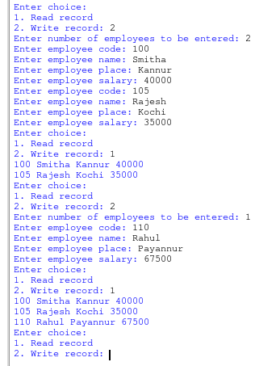


# Program 11

```python
import pickle

def read_records():
    with open("emp.dat", "rb") as f:
        try:
            while True:
                emp = pickle.load(f)
                empcode = emp["ecode"]
                name = emp["ename"]
                place = emp["eplace"]
                salary = emp["esal"]

                print(empcode, name,place, salary)
        except EOFError:
            pass

def write_records():
    with open("emp.dat","ab") as f:
        n = int(input("Enter number of employees to be entered: "))
        for i in range(n):
            emp = {}

            empcode = int(input("Enter employee code: "))
            name = input("Enter employee name: ")
            place = input("Enter employee place: ")
            salary = int(input("Enter employee salary: "))

            emp["ecode"] = empcode
            emp["ename"] = name
            emp["eplace"] = place
            emp["esal"] = salary
            pickle.dump(emp,f)

while True:
    ch = input("Enter choice:\n1. Read record\n2. Write record: ")
    if ch == "1":
        read_records()
    elif ch == "2":
        write_records()
    else:
        print("Invalid choice")


```

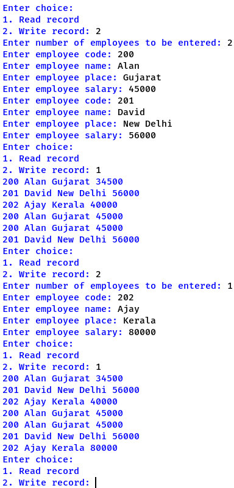


# Program 12

```python
import pickle

def search_records():
    with open("emp.dat", "rb") as f:
        found = False
        try:
            ecode = int(input("Enter employee code to search: "))
            while True:
                emp = pickle.load(f)
                if emp[0] == ecode:
                    empcode = emp[0]
                    name = emp[1]
                    place = emp[2]
                    salary = emp[3]
                    found = True
                    print(empcode, name,place, salary)
        except EOFError:
            pass
        if not found:
            print("Not Found")

def write_records():
    with open("emp.dat","ab") as f:
        n = int(input("Enter number of employees to be entered: "))
        for i in range(n):
            empcode = int(input("Enter employee code: "))
            name = input("Enter employee name: ")
            place = input("Enter employee place: ")
            salary = int(input("Enter employee salary: "))

            emp = [empcode,name,place,salary]
            pickle.dump(emp,f)

while True:
    ch = input("Enter choice:\n1. Search record\n2. Write record: ")
    if ch == "1":
        search_records()
    elif ch == "2":
        write_records()
    else:
        print("Invalid choice")

```

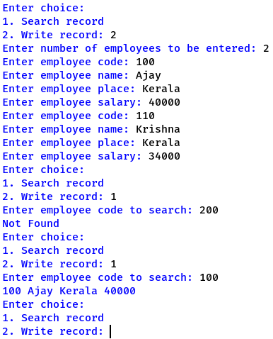


# Program 13

```python
import pickle

def search_records():
    with open("emp.dat", "rb") as f:
        found = False
        try:
            ecode = int(input("Enter employee code to search: "))
            while True:
                emp = pickle.load(f)
                if emp["ecode"] == ecode:
                    empcode = emp["ecode"]
                    name = emp["ename"]
                    place = emp["eplace"]
                    salary = emp["esal"]
                    found = True
                    print(empcode, name,place, salary)
        except EOFError:
            pass
        if not found:
            print("Not Found")

def write_records():
    with open("emp.dat","ab") as f:
        n = int(input("Enter number of employees to be entered: "))
        for i in range(n):
            empcode = int(input("Enter employee code: "))
            name = input("Enter employee name: ")
            place = input("Enter employee place: ")
            salary = int(input("Enter employee salary: "))

            emp = {}
            emp["ecode"] = empcode
            emp["ename"] = name
            emp["eplace"] = place
            emp["esal"] = salary
            pickle.dump(emp,f)

while True:
    ch = input("Enter choice:\n1. Search record\n2. Write record: ")
    if ch == "1":
        search_records()
    elif ch == "2":
        write_records()
    else:
        print("Invalid choice")

```

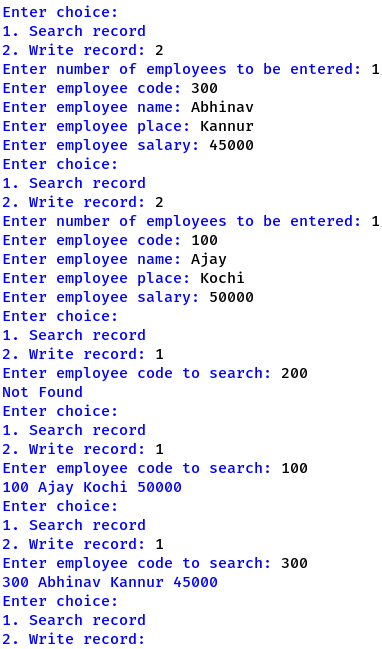


# Program 14

```python
import csv

def read_record():
    with open("emp.csv", "r") as f:

        csv_r = csv.reader(f)
        for i in csv_r:
            ecode = i[0]
            ename = i[1]
            esal = i[2]
            print(ecode,ename,esal)

def write_records():
    with open("emp.csv", "a") as f:
        csv_w = csv.writer(f)

        n = int(input("Enter number of employees to add: "))

        for i in range(n):
            empcode = int(input("Enter employee code: "))
            name = input("Enter employee name: ")
            salary = int(input("Enter employee salary: "))

            emp = [empcode,name,salary]
            csv_w.writerow(emp)


while True:
    ch = input("Enter choice:\n1. Read record\n2. Write record: ")
    if ch == "1":
        read_record()
    elif ch == "2":
        write_records()
    else:
        print("Invalid choice")

```

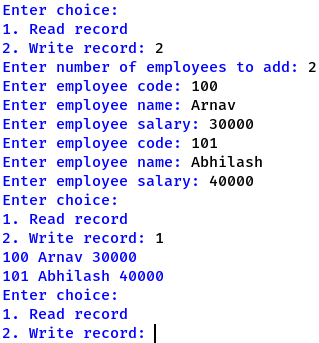

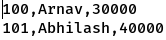


# Program 15

```python
import csv

def search_record():
    with open("emp.csv", "r") as f:
        csv_r = csv.reader(f)
        ecode = int(input("Enter ecode: "))
        found = False
        for i in csv_r:
            if int(i[0]) == ecode:
                found = True
                ecode = i[0]
                ename = i[1]
                esal = i[2]
                print(ecode,ename,esal)
        if not found:
            print("Not found")

def write_records():
    with open("emp.csv", "a") as f:
        csv_w = csv.writer(f)

        n = int(input("Enter number of employees to add: "))

        for i in range(n):
            empcode = int(input("Enter employee code: "))
            name = input("Enter employee name: ")
            salary = int(input("Enter employee salary: "))

            emp = [empcode,name,salary]
            csv_w.writerow(emp)


while True:
    ch = input("Enter choice:\n1. Search record\n2. Write record: ")
    if ch == "1":
        search_record()
    elif ch == "2":
        write_records()
    else:
        print("Invalid choice")

```

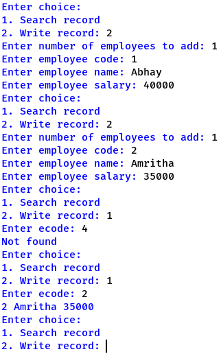

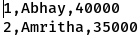


# Program 16

```python
import pickle
import os

def writerecord():
    with open("emp.dat","ab") as f:

        enono = int(input("Enter no: "))
        ename = input("Enter name: ")
        esal = int(input("Enter salary: "))

        emp =[enono,ename,esal] 
        pickle.dump(emp,f)

def display():
    with open("emp.dat", "rb") as f:
        try:
            while True:
                emp = pickle.load(f)
                empcode = emp[0]
                name = emp[1]
                salary = emp[2]

                print(empcode, name, salary)
        except EOFError:
            pass

def remove():
    f = open("emp.dat","rb")
    new_f = open("emp_backup.dat","wb")

    try:
        eno= int(input("Enter employee number to delete: "))
        while True:
            emp = pickle.load(f)
            if emp[0] == eno:
                continue
            pickle.dump(emp,new_f)
    except EOFError:
        pass

    os.remove("emp.dat")
    os.rename("emp_backup.dat","emp.dat")

	
while True:
    ch = input("Enter choice:\n1. Add record\n2. Remove record\n3. Display record: ")
    if ch == "1":
        writerecord()
    elif ch == "2":
        remove()
    elif ch == "3":
        display()
	

```

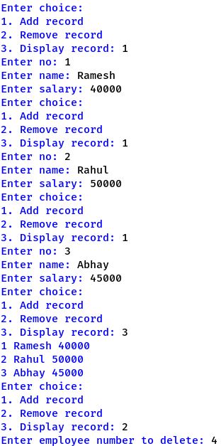

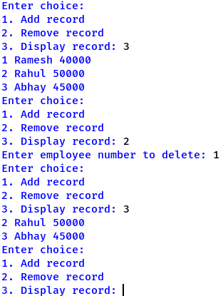


# Program 17

```python
import pickle

def add():
    with open("emp.dat","ab") as f:
        eidno = int(input("Enter employee number: "))
        ename = input("Enter employee name: ")
        esal = int(input("Enter employee salary: "))
        emp = [eidno,ename,esal]
        pickle.dump(emp,f)


def display():
    with open("emp.dat", "rb") as f:
        try:
            while True:
                emp = pickle.load(f)
                empcode = emp[0]
                name = emp[1]
                salary = emp[2]

                print(empcode, name, salary)
        except EOFError:
            pass

def updateesal():
	with open("emp.dat","rb+") as f:
		try:
			found = False
			eid= int(input("Enter eid to update: "))
			while True:
				orig = f.tell()
				emp = pickle.load(f)
				if emp[0] == eid:
					f.seek(orig)
					emp[2] = int(input("Enter new salary: "))
					found= True
					pickle.dump(emp,f)
		except EOFError:
			pass
		if not found:
			print("Not found")
		

	
while True:
    ch = input("Enter choice:\n1. Add record\n2. Update record\n3. Display record: ")
    if ch == "1":
        add()
    elif ch == "2":
        updateesal()
    elif ch == "3":
        display()

```

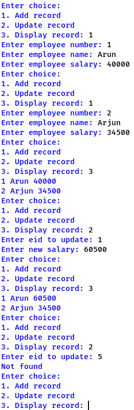


# Program 18

```python
import pickle
import os

def writerecord():
    rollno = int(input("Enter roll: "))
    name = input("Enter name: ")
    mark = int(input("Enter marks: "))

    with open("stu.dat","ab") as f:
        stu = [rollno,name,mark]
        pickle.dump(stu,f)

def display():
    with open("stu.dat", "rb") as f:
        try:
            while True:
                stu = pickle.load(f)
                rollno = stu[0]
                name = stu[1]
                mark = stu[2]

                print(rollno, name, mark)
        except EOFError:
            pass

def remove():
	f = open("stu.dat","rb")
	new_f = open("stu_backup.dat","wb")
	
	try:
		roll= int(input("Enter roll to delete: "))
		while True:
			orig = f.tell()
			stu = pickle.load(f)
			if stu[0] == roll:
				continue
			pickle.dump(stu,new_f)
	except EOFError:
		pass
	

	os.remove("stu.dat")
	os.rename("stu_backup.dat","stu.dat")

	
while True:
    ch = input("Enter choice:\n1. Add record\n2. Remove record\n3. Display record: ")
    if ch == "1":
        writerecord()
    elif ch == "2":
        remove()
    elif ch == "3":
        display()


```

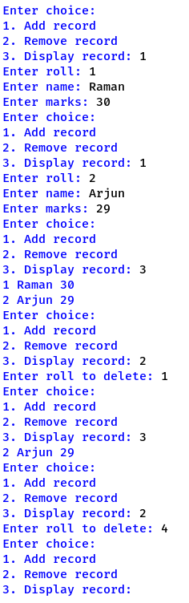


# Program 19

```python
import pickle

def add():
    with open("stu.dat","ab") as f:
        rollno = int(input("Enter roll: "))
        name = input("Enter name: ")
        mark = int(input("Enter marks: "))
        stu = [rollno,name,mark]
        pickle.dump(stu,f)

def display():
    with open("stu.dat", "rb") as f:
        try:
            while True:
                stu = pickle.load(f)
                rollno = stu[0]
                name = stu[1]
                mark = stu[2]

                print(rollno, name, mark)
        except EOFError:
            pass

def updatemark():
	with open("stu.dat","rb+") as f:
		try:
			found = False
			roll= int(input("Enter roll to update: "))
			while True:
				orig = f.tell()
				stu = pickle.load(f)
				if stu[0] == roll:
					f.seek(orig)
					stu[2] = int(input("Enter new mark: "))
					found= True
					pickle.dump(stu,f)
		except EOFError:
			pass
		if not found:
			print("Not found")
		

	
while True:
    ch = input("Enter choice:\n1. Add record\n2. Update record\n3. Display record: ")
    if ch == "1":
        add()
    elif ch == "2":
        updatemark()
    elif ch == "3":
        display()
        

```

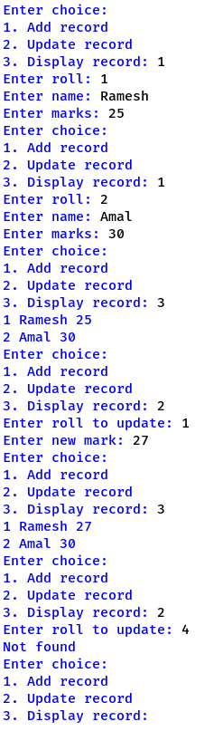


# Program 20

```python
s = []

def push():
	bid = int(input("Enter id: "))
	bname = input("Enter name: ")
	bauthor = input("Enter author: ")
	book =[bid,bname,bauthor]
	s.append(book)


def pop():
    if len(s) == 0:
        print("Underflow")
        return

    bp = s.pop()
    bid = bp[0]
    bname = bp[1]
    bauthor =  bp[2]

    print('The book to be popped is: ')
    print("Id: ",bid)
    print("Name: ",bname)
    print("Author: ",bauthor)

while True:
    ch = input("Menu:\n1. Push\n2. Pop: ")
    if ch == "1":
        push()
    elif ch == "2":
        pop()
    else:
        print("invalid input")

```

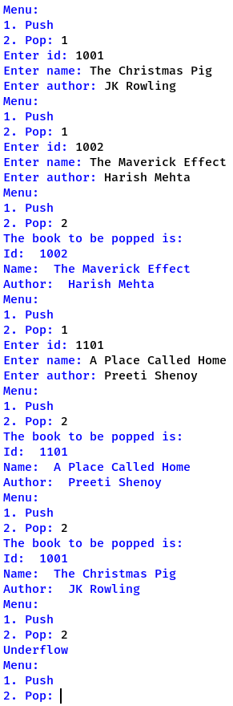


# Program 21

```python
s = []

def push():
	emid = int(input("Enter id: "))
	emname = input("Enter name: ")
	emsal = int(input("Enter salary: "))
	emp = [emid,emname,emsal]
	s.append(emp)

def pop():
    if len(s) == 0:
        print("Underflow")
        return

    emp = s.pop()
    emid = emp[0]
    emname = emp[1]
    emsal =  emp[2]

    print("The employee to be popped is: ")
    print("Id: ",emid)
    print("Name: ",emname)
    print("Salary: ",emsal)

while True:
    ch = input("Menu:\n1. Push\n2. Pop: ")
    if ch == "1":
        push()
    elif ch == "2":
        pop()
    else:
        print("invalid input")

```

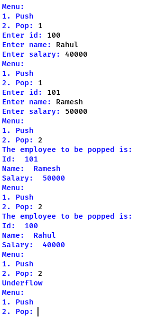


